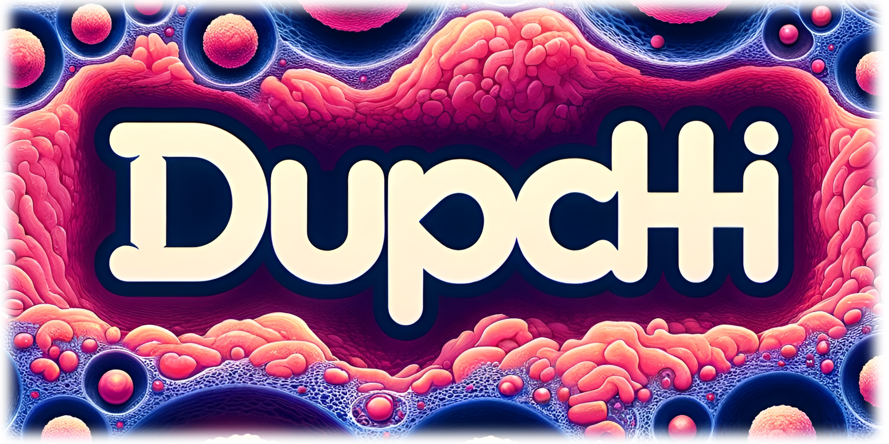
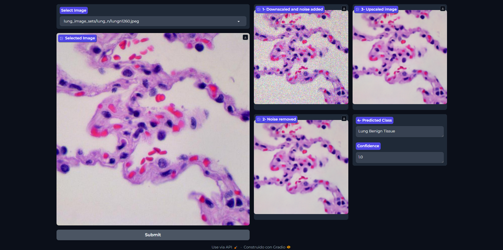

# 🧬 DUPCHI - Denoise, Upscale and Predict Cancer from Histopathological Images

Bienvenido al repositorio de DUPCHI, una aplicación avanzada de aprendizaje profundo destinada a la predicción de cáncer de colon y pulmón a partir de imágenes histopatológicas.

## 🤖 Modelos empleados

- **Autoencoder**: Utilizado para la eliminación de ruido en imágenes.
- **ESRGAN**: Empleada para el aumento de la resolución de imágenes.
- **ResNet152_v2**: Arquitectura de CNN para la predicción del tipo de cáncer.

## ⚙️ Pipeline de la app

1. **Elección de la imagen**: El usuario escoge una imagen a procesar.
2. **Obtención de la imagen**: La imagen se extrae de un bucket de Google Cloud Storage
3. **Downsampling**: La imagen se reduce de 768x768 a 224x224.
4. **Adición de Ruido y Limpieza**: Se añade ruido artificialmente y se utiliza un autoencoder para eliminarlo.
5. **Upsampling**: Las imágenes se procesan a través de ESRGAN para aumentar la resolución 2x.
6. **Predicción del Cáncer**: Finalmente, se usa una red convolucional ResNet_v2 para determinar el tipo de cáncer en las imágenes.

## 🚀 Comenzando

Para usar DUPCHI, sigue estos pasos:

1. Clona el repositorio:
```bash
git clone https://github.com/Yago-145/dupchi.git
```
2. Crea un entorno con Anaconda:
```bash
conda create --name dupchi python=3.10
```
3. Activa el entorno:
```bash
conda activate dupchi
```
4. Instala el proyecto:
```bash
pip install -e .
```
5. Instala Poetry:
```bash
pip install poetry
```
6. Ejecuta Poetry:
```bash
poetry install
```
7. Inicia la aplicación:
```bash
make app
```

## 👨🏻‍💻 Funcionamiento de la app

La aplicación ha sido desarrollada en `Gradio`, consiguiendo así una interfaz de usuario sencilla y ordenada.

Una vez el usuario escoge la imagen deseada, hace click en el botón de *Submit* y empieza el procesamiento.

A la parte izquierda se puede observar la imagen escogida por el usuario y en la parte derecha se puede ver el resultado tras cada uno de los pasos de la pipeline.

Aquí un ejemplo de cómo sería:


## ⚠️ Advertencia

La aplicación está diseñada para procesar imágenes almacenadas en un bucket de GCP. Es necesario hacer login con una service account de Google Cloud Platform para testear la aplicación correctamente.

Asegúrate de tener configurado correctamente el acceso a GCP para evitar problemas de autenticación y acceso a los datos.

## 🎫 Licencia

`dupchi` ha sido creado por Javier Yago Córcoles. Tiene licencia según los términos de la licencia MIT.

## ©️ Créditos

Modelo de ESRGAN cogido del siguiente [repositorio de GitHub](https://github.com/aladdinpersson/Machine-Learning-Collection/tree/master/ML/Pytorch/GANs/ESRGAN), pesos del modelo descargados de este [enlace](https://github.com/aladdinpersson/Machine-Learning-Collection/releases/tag/1.0).

`dupchi` creado a partir de [Angel Martinez-Tenor's Data Science Template](https://github.com/angelmtenor/ds-template), que a su vez fue desarrollado en base a la [py-pkgs-cookiecutter template](https://github.com/py-pkgs/py-pkgs-cookiecutter)

